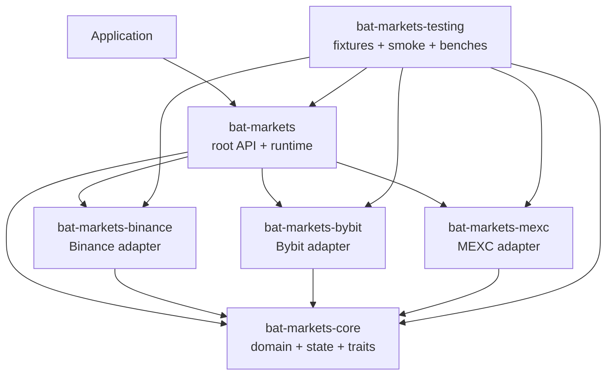
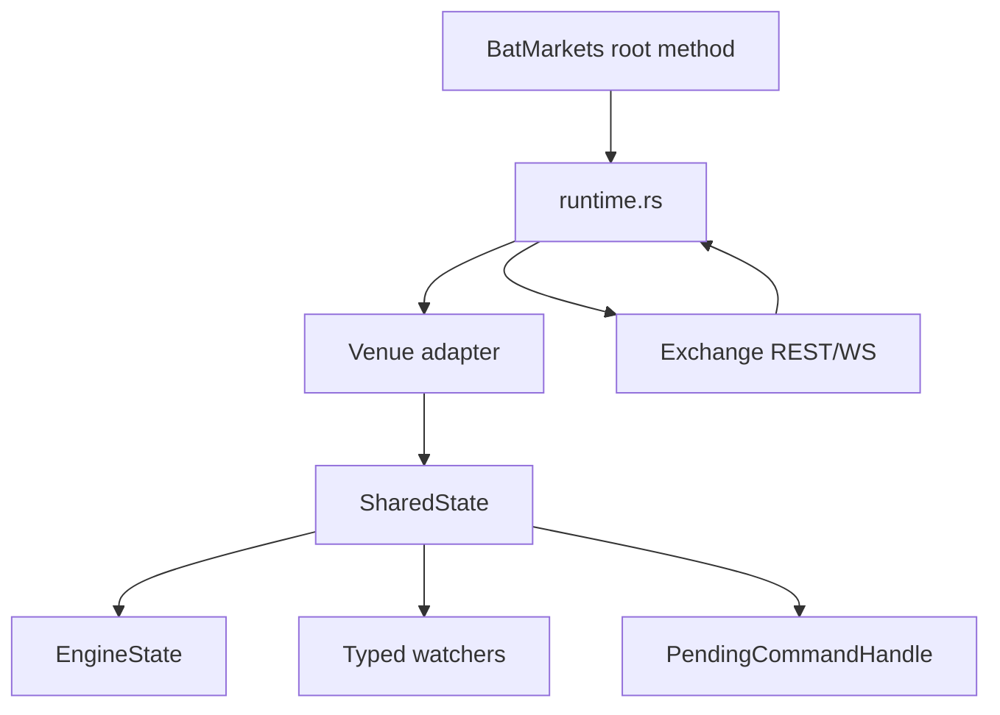
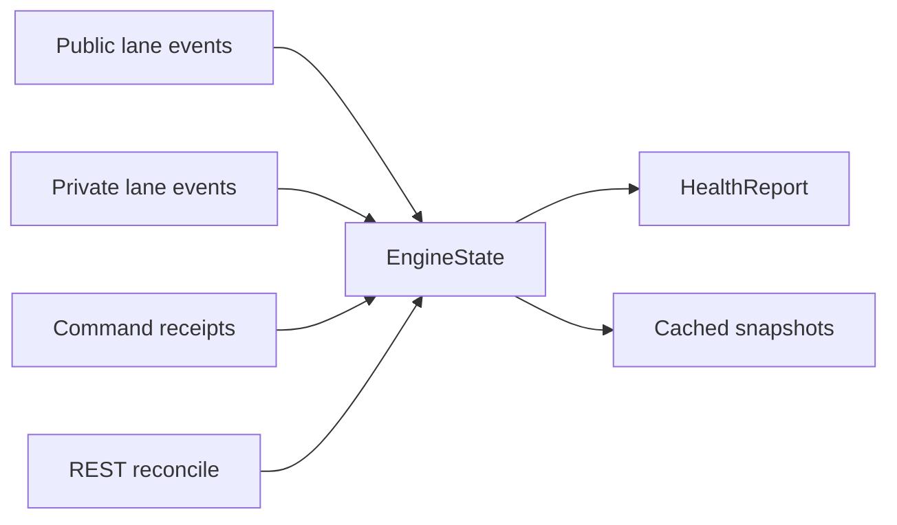
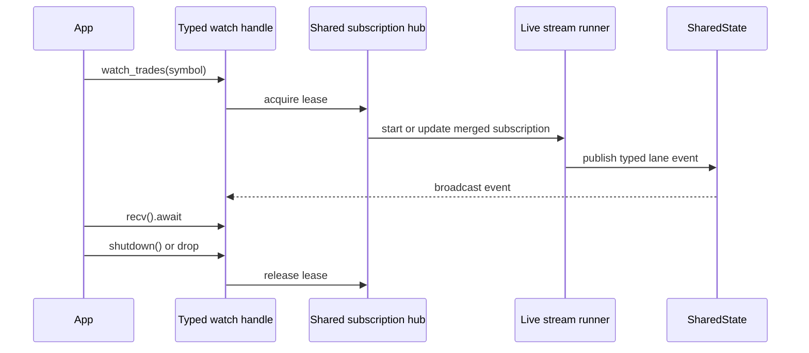
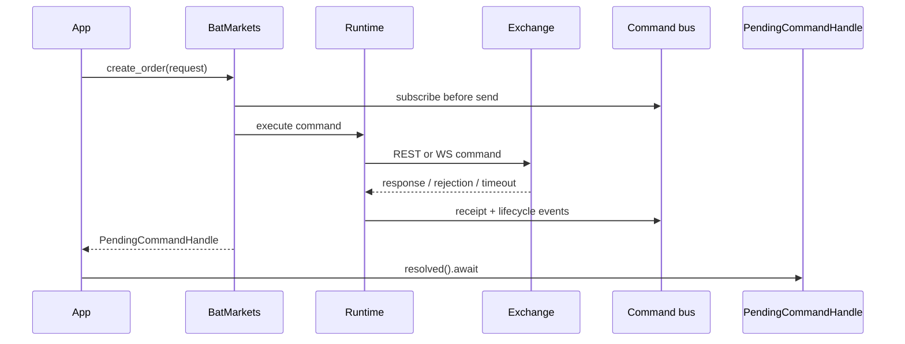

# Architecture

Technical map for `bat-markets` v0.3.x.

## Goals

- Keep the public API small and root-level.
- Keep exchange-specific behavior isolated in adapter crates.
- Keep financial data typed and deterministic.
- Keep websocket watchers shared instead of spawning duplicate sockets.
- Keep command uncertainty explicit through `UnknownExecution` and reconcile.
- Keep release, CI, and crates.io publishing consistent from one workspace version.

## Current Measurements

Measured on 2026-05-05 from the local `v0.3.4` release gate.

| Area | Value |
| --- | ---: |
| Workspace crates | 6 |
| Published crates | 5 |
| Rust source files in `crates/` | 53 |
| Fixture JSON files | 44 |
| Test and doctest entries | 130 |
| Documentation Markdown files | 9 regular files plus `docs/blueprint.md` symlink |

Package footprint from the release gate:

| Package | Files | Uncompressed | Compressed |
| --- | ---: | ---: | ---: |
| `bat-markets-core` | 26 | 142.6 KiB | 30.1 KiB |
| `bat-markets-binance` | 7 | 116.2 KiB | 21.9 KiB |
| `bat-markets-bybit` | 7 | 105.8 KiB | 21.2 KiB |
| `bat-markets-mexc` | 7 | 89.3 KiB | 19.4 KiB |
| `bat-markets` | 21 | 635.6 KiB | 92.2 KiB |

Short local benchmark baseline:

```bash
cargo bench -p bat-markets-testing --bench engine -- --sample-size 10 --measurement-time 1
```

| Benchmark | Criterion interval |
| --- | ---: |
| `binance_public_ingest` | 116.01 us to 152.28 us |
| `bybit_private_ingest` | 108.23 us to 121.22 us |
| `bybit_public_ingest` | 112.37 us to 119.71 us |
| `command_classification` | 106.70 us to 206.69 us |
| `batch_command_surface` | 218.20 us to 254.56 us |
| `binance_runtime_batch_entry_path` | 383.61 us to 444.36 us |
| `bybit_runtime_batch_entry_path` | 320.96 us to 767.46 us |
| `liquidation_cache_reads` | 121.28 ns to 130.73 ns |

These are local fixture/stub measurements, not public SLA values.

## Workspace



| Crate | Published | Owns |
| --- | --- | --- |
| `bat-markets` | yes | Public facade, live REST/WS runtime, shared hubs, command transport, diagnostics |
| `bat-markets-core` | yes | Domain types, errors, config, capabilities, state engine, adapter trait |
| `bat-markets-binance` | yes | Binance native payloads, symbol rules, decoders, command classification |
| `bat-markets-bybit` | yes | Bybit native payloads, symbol rules, decoders, command classification |
| `bat-markets-mexc` | yes | MEXC native payloads, symbol rules, decoders, command classification |
| `bat-markets-testing` | no | Fixtures, live smoke helpers, stress tests, Criterion benches |

Dependency rule: core imports no venue or facade crate. Venue crates depend on
core. The facade depends on core and enabled venue crates. Testing depends on
everything.

## Repository Map

| Path | Owns |
| --- | --- |
| `Cargo.toml` | Workspace version, members, shared dependencies, lints |
| `Cargo.lock` | Locked dependency graph for CI/release |
| `README.md` | crates.io-facing install, method reference, runtime rules |
| `CHANGELOG.md` | Release history; required by release verification |
| `blueprint.md` | High-level product and engineering blueprint |
| `.github/workflows/ci.yml` | Full release gate on `main` and pull requests |
| `.github/workflows/publish-crates.yml` | Tag/manual publishing workflow |
| `scripts/check.sh` | One local/CI quality gate |
| `scripts/verify-release.sh` | Version, changelog, lockfile, and tag consistency |
| `scripts/publish-crates.sh` | Dependency-ordered crates.io publish |
| `docs/` | Architecture, release process, and ADRs |
| `fixtures/binance/` | Binance deterministic protocol fixtures |
| `fixtures/bybit/` | Bybit deterministic protocol fixtures |
| `fixtures/mexc/` | MEXC deterministic protocol fixtures |

## Facade Modules

| File | Owns |
| --- | --- |
| `crates/bat-markets/src/lib.rs` | crate docs, public exports, missing-docs gate |
| `client.rs` | `BatMarkets`, builder, adapter selection, auth wiring, shared state |
| `facade.rs` | root methods for reads, watches, commands, and `advanced()` |
| `advanced.rs` | raw ingestion, cached reads, raw subscriptions, reconcile, diagnostics, native access |
| `runtime.rs` | REST calls, stream runners, command execution, reconcile, rate limiting |
| `stream.rs` | typed watch handles and event filtering |
| `subscriptions.rs` | shared public/private websocket hubs and leases |
| `transport.rs` | authenticated command websocket session |
| `entry.rs` | `PendingCommandHandle` and command recovery resolution |
| `diagnostics.rs` | runtime latency and lock diagnostics |
| `health.rs` | health watch wrapper |
| `native.rs` | venue-specific adapter access |
| `capabilities.rs`, `config.rs`, `errors.rs`, `types.rs` | public re-export modules |

## Core Modules

| File | Owns |
| --- | --- |
| `account.rs` | balances and account summary |
| `adapter.rs` | `VenueAdapter` trait |
| `auth.rs` | signers |
| `capability.rs` | capability model |
| `catalog.rs` | instrument catalog |
| `command.rs` | command operations, receipts, lifecycle, transport |
| `config.rs` | endpoints, auth, timeouts, retry, reconnect, state policy |
| `error.rs` | `MarketError`, `ErrorKind`, `Result` |
| `execution.rs` | public/private/command lane events |
| `health.rs` | health status and reports |
| `ids.rs` | typed identifiers |
| `instrument.rs` | instrument metadata |
| `market.rs` | market snapshots, fast events, OHLCV requests |
| `numeric.rs` | decimal wrappers and quantized fast values |
| `position.rs` | position snapshot |
| `primitives.rs` | timestamps and sequence numbers |
| `reconcile.rs` | reconcile triggers, reports, snapshots |
| `state.rs` | `EngineState` projection and merge logic |
| `trade.rs` | orders, executions, command requests |
| `types.rs` | shared enums |

## Runtime Flow



## API Zones

| Zone | Method pattern | Output style |
| --- | --- | --- |
| Metadata/status | `markets`, `load_markets`, `status`, `watch_status` | snapshots or status watcher |
| Public REST | `fetch_*` market methods | typed market snapshots |
| Private REST | `fetch_*` account/order methods | typed account/order snapshots |
| Public WS | `watch_*` market methods | typed watch handles |
| Private WS | `watch_*` account/order methods | typed watch handles |
| Commands | `create_*`, `edit_*`, `cancel_*`, `close_*`, `set_*`, `validate_*` | `PendingCommandHandle` |
| Advanced | `advanced().*` | raw events, cached state, diagnostics, native adapters |

README is the public method reference and lists every root and advanced method.

## State Model



`EngineState` is the single local projection. Public data, private data,
commands, and reconcile all merge through the same state owner.

Numeric rule: public/state values use decimal wrappers; hot-path fast events use
quantized integers. Public/state contracts do not use `f64`.

## Watch Model



One watcher does not own the exchange socket. The hub owns the stream, merges
active leases, and shuts down when no lease remains.

## Command Model



If the write result cannot be proven, the receipt remains `UnknownExecution`.
The runtime records recovery context and uses private stream or REST history
evidence to resolve what it can.

## Release Gate

`./scripts/check.sh` is the only release gate:

1. release verification
2. `cargo fmt --all --check`
3. workspace clippy with all features
4. workspace tests and doctests
5. workspace docs
6. single-venue clippy for Binance
7. single-venue clippy for Bybit
8. single-venue clippy for MEXC
9. `cargo audit`
10. package verification for published crates
11. benchmark compilation

Publish order is fixed: core, Binance adapter, Bybit adapter, MEXC adapter,
facade. The publish script waits for each crate version to become visible on
crates.io before publishing dependents.
