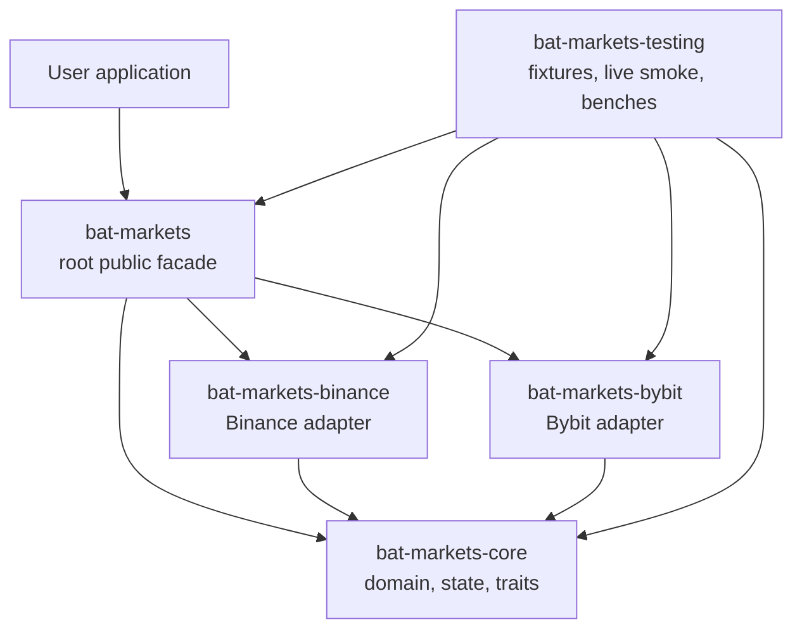
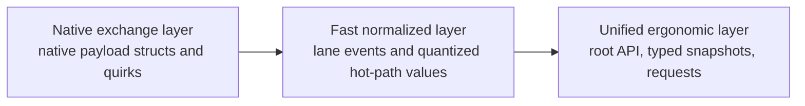
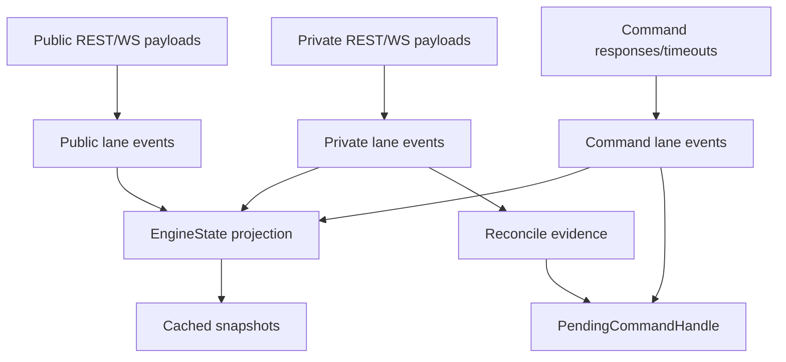
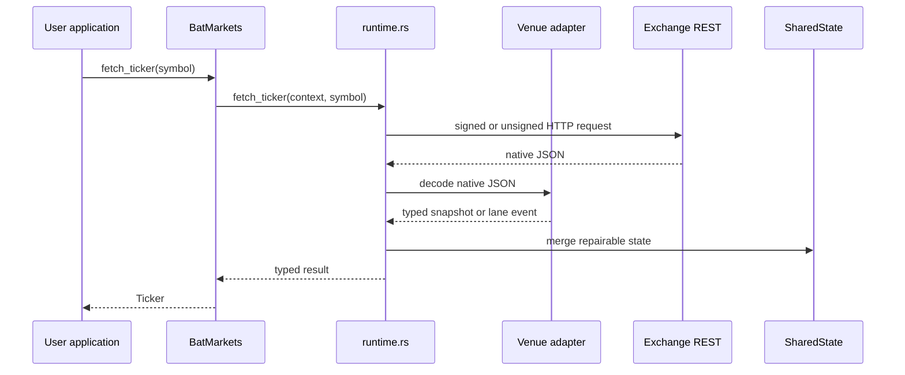
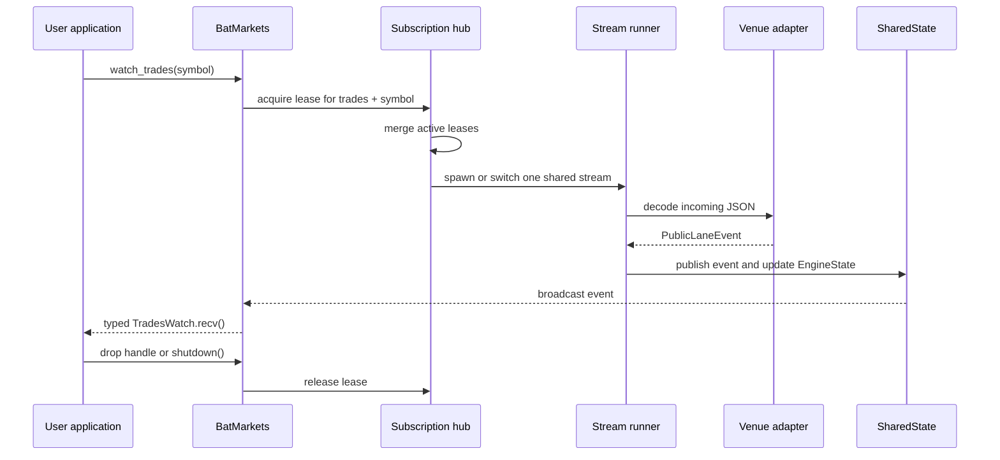
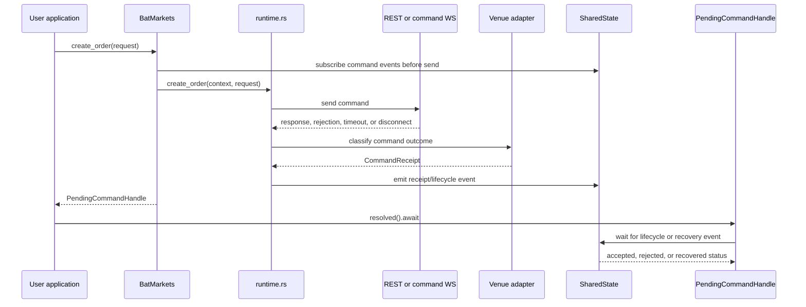
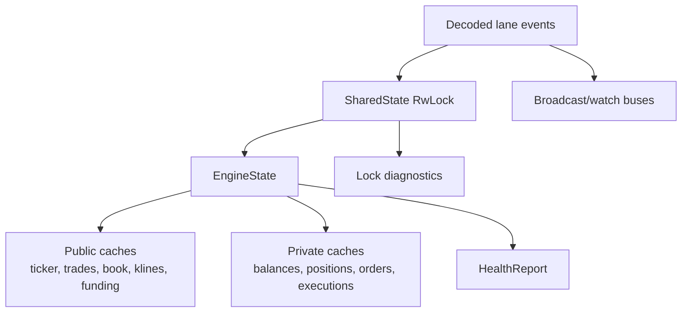
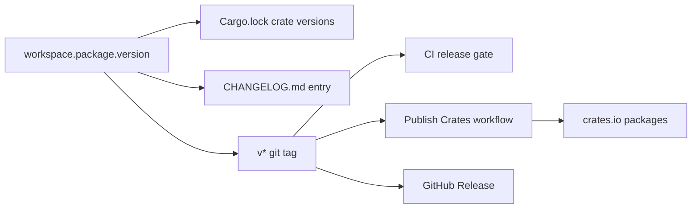

# Architecture

This document is the main technical map for `bat-markets` v0.3.x. It explains
what each folder owns, how the runtime works, why the main decisions were made,
and which measurements currently describe the repository.

## Source Of Truth

The source-of-truth order is:

1. `blueprint.md`
2. repository code and tests
3. Rust ecosystem best practices
4. ADRs in `docs/adr/`

If this document conflicts with code, the code wins and this document must be
updated in the same change.

## Current Snapshot

Measured on 2026-04-25 from commit `fcc2597` tagged `v0.3.0`.

| Area | Measurement |
| --- | --- |
| Workspace version | `0.3.0` |
| Published runtime crates | `bat-markets-core`, `bat-markets-binance`, `bat-markets-bybit`, `bat-markets` |
| Workspace-only crate | `bat-markets-testing` |
| Rust source files in `crates/` | 51 |
| JSON fixture files | 39 |
| Documentation Markdown files | 14 regular files plus `docs/blueprint.md` symlink |
| Test and doctest entries from `cargo test --workspace -- --list` | 105 |
| Current release tag | `v0.3.0` |
| Current release commit | `fcc2597 Release v0.3.0 with clean root API` |

The code footprint by source area:

| Path | Files | Rust | Markdown | JSON | Measured lines |
| --- | ---: | ---: | ---: | ---: | ---: |
| `crates/bat-markets` | 17 | 16 | 0 | 0 | 13,056 |
| `crates/bat-markets-core` | 22 | 21 | 0 | 0 | 3,155 |
| `crates/bat-markets-binance` | 3 | 2 | 0 | 0 | 2,480 |
| `crates/bat-markets-bybit` | 3 | 2 | 0 | 0 | 2,203 |
| `crates/bat-markets-testing` | 11 | 10 | 0 | 0 | 5,856 |
| `docs` | 14 regular files | 0 | 14 | 0 | 1,360 |
| `fixtures` | 39 | 0 | 0 | 39 | 58 |
| `scripts` | 3 | 0 | 0 | 0 | 229 |
| `.github/workflows` | 2 | 0 | 0 | 0 | 95 |

Short performance baseline from:

```bash
cargo bench -p bat-markets-testing --bench engine -- --sample-size 10 --measurement-time 1
```

| Benchmark | Criterion time interval |
| --- | ---: |
| `binance_public_ingest` | 116.01 us to 152.28 us |
| `bybit_private_ingest` | 108.23 us to 121.22 us |
| `bybit_public_ingest` | 112.37 us to 119.71 us |
| `command_classification` | 106.70 us to 206.69 us |
| `batch_command_surface` | 218.20 us to 254.56 us |
| `binance_runtime_batch_entry_path` | 383.61 us to 444.36 us |
| `bybit_runtime_batch_entry_path` | 320.96 us to 767.46 us |
| `liquidation_cache_reads` | 121.28 ns to 130.73 ns |

These numbers are a local engineering baseline, not a public SLA. They cover
fixture/stub paths and should be compared on the same machine and command line.

## Product Shape

`bat-markets` is a futures-first, headless Rust exchange engine for Binance
USD-M and Bybit USDT linear futures. It is not a UI app, bot framework, or
strategy engine. It owns exchange connectivity, normalized domain contracts,
state projection, reconciliation, and safe command lifecycle reporting.

The public API follows the CCXT mental model:

| Family | Meaning | Examples |
| --- | --- | --- |
| Metadata/cache | Local and live market metadata | `markets`, `load_markets` |
| Public REST | Unauthenticated reads | `fetch_ticker`, `fetch_order_book`, `fetch_ohlcv` |
| Private REST | Authenticated account reads | `fetch_balance`, `fetch_positions`, `fetch_open_orders` |
| Public WS | Live market updates | `watch_ticker`, `watch_trades`, `watch_order_book` |
| Private WS | Live account updates | `watch_balance`, `watch_orders`, `watch_positions` |
| Commands | Writes and settings | `create_order`, `edit_order`, `cancel_order`, `set_leverage` |
| Advanced | Low-level escape hatch | `advanced().native()`, `advanced().diagnostics()` |

The internal public/private/command lanes still exist because they are the right
shape for performance, state ownership, and reconciliation. Users interact with
the root facade first and only use `advanced()` when they need low-level control.

## Repository Map

Generated artifacts, `target/`, ignored environment files, and local editor
state are not part of the architecture. The tracked repository is intentionally
small and split by responsibility.

### Root

| Path | Responsibility |
| --- | --- |
| `Cargo.toml` | Virtual workspace manifest, shared version, shared dependencies, shared lints |
| `Cargo.lock` | Locked dependency graph used by CI, release verification, and reproducible local checks |
| `rust-toolchain.toml` | Rust toolchain pin for local and CI consistency |
| `README.md` | crates.io-facing overview, install instructions, API map, safety model |
| `CHANGELOG.md` | Human release history; `scripts/verify-release.sh` requires the current version entry |
| `CONTRIBUTING.md` | Contributor workflow and project conventions |
| `SECURITY.md` | Security policy and responsible disclosure guidance |
| `LICENSE-APACHE` | Apache-2.0 license text |
| `LICENSE-MIT` | MIT license text |
| `.gitignore` | Keeps build output, credentials, and local files out of Git |
| `blueprint.md` | Highest-level technical and product blueprint |

### GitHub Automation

| Path | Responsibility |
| --- | --- |
| `.github/workflows/ci.yml` | Runs the full release gate on pushes to `main` and pull requests |
| `.github/workflows/publish-crates.yml` | Runs the same release gate before crates.io publishing from `v*` tags or manual dispatch |

### Scripts

| Path | Responsibility |
| --- | --- |
| `scripts/check.sh` | Single local and CI quality gate: release verify, fmt, clippy, tests, docs, single-venue clippy, audit, package, bench build |
| `scripts/verify-release.sh` | Ensures workspace version, changelog, lockfile, tag, and internal dependency versions are consistent |
| `scripts/publish-crates.sh` | Publishes runtime crates in dependency order and waits until each version is visible on crates.io |

### Documentation

| Path | Responsibility |
| --- | --- |
| `docs/architecture.md` | This architecture, structure, flow, and measurements map |
| `docs/blueprint.md` | Symlink to root `blueprint.md` for docs navigation |
| `docs/capability-matrix.md` | Venue and API support matrix |
| `docs/error-model.md` | Error categories and how callers should reason about failures |
| `docs/migration-v0.2.md` | Migration notes for the CCXT-style root API redesign |
| `docs/migration-v0.3.md` | Migration notes for the clean v0.3 root API surface |
| `docs/release.md` | Human release and crates.io process |
| `docs/roadmap.md` | Near-term product direction |
| `docs/adr/0001-project-shape.md` | Workspace and crate shape decision |
| `docs/adr/0002-api-layers-and-lanes.md` | API layers and execution lanes decision |
| `docs/adr/0003-engine-first-foundation.md` | Engine-first before live transport decision |
| `docs/adr/0004-live-transport-and-reconcile.md` | Internal live transport and snapshot reconcile decision |
| `docs/adr/0005-sequence-aware-transport-maintenance.md` | Sequence-aware maintenance decision |
| `docs/adr/0006-github-source-release-model.md` | GitHub-first source release decision |
| `docs/adr/0007-crates-io-publication-model.md` | crates.io publication model decision |

## Workspace Crates



| Crate | Published | Responsibility |
| --- | --- | --- |
| `bat-markets` | yes | Public facade, root API, live REST/WS runtime, shared subscription hubs, command transport, diagnostics |
| `bat-markets-core` | yes | Shared domain model, typed IDs, numeric wrappers, error taxonomy, adapter trait, engine state, lane events |
| `bat-markets-binance` | yes | Binance USD-M linear futures native payloads, metadata, decoding, command classification |
| `bat-markets-bybit` | yes | Bybit USDT linear futures native payloads, metadata, decoding, command classification |
| `bat-markets-testing` | no | Test helpers, live smoke tests, fixtures, stress paths, benchmarks |

The dependency direction is intentionally one way: adapters depend on `core`,
the facade depends on adapters and `core`, and tests depend on everything. Core
never depends on the facade or venue crates.

## Public Facade Files

`crates/bat-markets` is the only crate most users need directly.

| File | Responsibility |
| --- | --- |
| `Cargo.toml` | Public package metadata, features, and runtime dependencies |
| `src/lib.rs` | Crate-level rustdoc, public module exports, missing-docs gate |
| `src/client.rs` | `BatMarkets`, builder, adapter selection, auth wiring, shared state initialization |
| `src/facade.rs` | CCXT-style root methods: `fetch_*`, `watch_*`, commands, `advanced()` |
| `src/advanced.rs` | Low-level raw event ingestion, raw subscriptions, cached reads, reconcile, diagnostics, native access |
| `src/runtime.rs` | Live REST calls, websocket stream runners, metadata refresh, command execution, reconcile, rate limiting |
| `src/stream.rs` | Typed watch handles, public/private lane clients, filtering, `recv`, `shutdown` |
| `src/subscriptions.rs` | Shared public/private websocket hubs and RAII leases |
| `src/transport.rs` | Authenticated command websocket session and request/response routing |
| `src/entry.rs` | `PendingCommandHandle`, command resolution, `UnknownExecution` recovery behavior |
| `src/diagnostics.rs` | Runtime latency and shared-state lock diagnostics |
| `src/health.rs` | Status watch handle over health snapshots |
| `src/native.rs` | Venue-specific native access wrapper under `advanced().native()` |
| `src/capabilities.rs` | Public re-exports for capability contracts |
| `src/config.rs` | Public re-exports for runtime config contracts |
| `src/errors.rs` | Public re-exports for error contracts |
| `src/types.rs` | Public re-exports for domain and request/response types |

## Core Domain Files

`crates/bat-markets-core` is the exchange-neutral contract layer.

| File | Responsibility |
| --- | --- |
| `Cargo.toml` | Core package metadata and dependencies |
| `src/lib.rs` | Core module tree and public re-exports |
| `src/account.rs` | Balance and account summary types |
| `src/adapter.rs` | `VenueAdapter` trait used by facade and venue crates |
| `src/auth.rs` | Signing abstractions and env/memory HMAC signers |
| `src/capability.rs` | Capability model for market, trade, position, account, asset, native support |
| `src/catalog.rs` | Instrument catalog helper |
| `src/command.rs` | Command operations, receipts, acknowledgements, lifecycle events, transports |
| `src/config.rs` | Runtime config, endpoints, auth, timeout, retry, reconnect, rate-limit, state policies |
| `src/error.rs` | `MarketError`, `ErrorKind`, context, and project `Result` |
| `src/execution.rs` | Public/private/command lane events, divergence events, lane policy |
| `src/health.rs` | Health status, degraded reasons, notifications, report projection |
| `src/ids.rs` | Typed IDs for assets, instruments, orders, positions, requests, trades |
| `src/instrument.rs` | Instrument metadata, status, and support flags |
| `src/market.rs` | Fast market events, ergonomic market snapshots, OHLCV helpers, watch/fetch requests |
| `src/numeric.rs` | Decimal value wrappers and quantized fast numeric types |
| `src/position.rs` | Position snapshot type |
| `src/primitives.rs` | Sequence numbers and millisecond timestamps |
| `src/reconcile.rs` | Reconcile triggers, outcomes, reports, private snapshots, account snapshots |
| `src/state.rs` | In-memory `EngineState` projection and merge logic |
| `src/trade.rs` | Orders, executions, command request types, edit aliases |
| `src/types.rs` | Shared enums such as venue, product, side, order type, margin mode |

## Venue Adapter Files

Adapters preserve venue-specific behavior while emitting shared lane events.

| File | Responsibility |
| --- | --- |
| `crates/bat-markets-binance/Cargo.toml` | Binance package metadata |
| `crates/bat-markets-binance/src/lib.rs` | Binance adapter, static specs, parser normalization, command classification |
| `crates/bat-markets-binance/src/native.rs` | Binance native REST/WS payload structs and envelopes |
| `crates/bat-markets-bybit/Cargo.toml` | Bybit package metadata |
| `crates/bat-markets-bybit/src/lib.rs` | Bybit adapter, static specs, parser normalization, command classification |
| `crates/bat-markets-bybit/src/native.rs` | Bybit native REST/WS payload structs and envelopes |

The adapters do not own HTTP clients or long-running sockets. They own payload
knowledge: symbol mapping, native fields, decoding, capability reporting, and
how command responses are classified.

## Testing And Fixtures

| Path | Responsibility |
| --- | --- |
| `crates/bat-markets-testing/Cargo.toml` | Unpublished test package metadata |
| `crates/bat-markets-testing/src/lib.rs` | Fixture loading, live-test config, smoke helpers, fake/stub flows |
| `crates/bat-markets-testing/src/live_trade_cycle.rs` | Shared live create/cancel cycle helpers |
| `crates/bat-markets-testing/benches/engine.rs` | Criterion benchmark entry for decode/normalize/state paths |
| `crates/bat-markets-testing/tests/stress_paths.rs` | Offline stress tests for bounded ingest behavior |
| `crates/bat-markets-testing/tests/ohlcv_stress.rs` | OHLCV paging and multi-symbol watch stress tests |
| `crates/bat-markets-testing/tests/mainnet_readonly.rs` | Env-gated readonly mainnet smoke tests |
| `crates/bat-markets-testing/tests/sandbox_live.rs` | Env-gated sandbox read/write smoke tests |
| `crates/bat-markets-testing/tests/binance_demo_stress.rs` | Env-gated Binance demo command stress |
| `crates/bat-markets-testing/tests/binance_mainnet_trade_cycle.rs` | Env-gated Binance mainnet trade-cycle smoke |
| `crates/bat-markets-testing/tests/binance_mainnet_extended_stress.rs` | Env-gated extended Binance mainnet stress |

Fixtures are grouped by venue:

| Path | Fixture responsibility |
| --- | --- |
| `fixtures/binance/*.json` | Binance public/private payloads, REST snapshots, command success/reject responses |
| `fixtures/bybit/*.json` | Bybit public/private payloads, REST snapshots, command success/reject responses, gap cases |

The fixture set is intentionally checked in. It gives deterministic protocol
coverage without requiring live credentials for normal CI.

## Runtime Architecture

```mermaid
flowchart TB
    User["User application"]
    Root["BatMarkets root API<br/>fetch, watch, command, advanced"]
    Runtime["Live runtime<br/>REST, WS runners, reconcile, rate limits"]
    Hubs["Subscription hubs<br/>public and private shared leases"]
    Transport["Command WS transport<br/>authenticated request routing"]
    Shared["SharedState<br/>EngineState + event buses + health"]
    Core["bat-markets-core<br/>typed contracts"]
    Adapter["Venue adapter<br/>Binance or Bybit"]
    Exchange["Exchange REST/WS"]

    User --> Root
    Root --> Runtime
    Root --> Hubs
    Root --> Shared
    Runtime --> Adapter
    Runtime --> Transport
    Runtime --> Exchange
    Hubs --> Runtime
    Transport --> Exchange
    Adapter --> Core
    Runtime --> Shared
    Shared --> Core
```



The runtime is kept inside `bat-markets` instead of a separate public transport
crate. This keeps the transport implementation replaceable during `0.x` while
the user-facing API and core contracts stabilize.

## API Layering



| Layer | Owned by | Why it exists |
| --- | --- | --- |
| Native | Venue crates | Preserve real exchange fields, quirks, and diagnostics without hiding differences |
| Fast normalized | `bat-markets-core` lane events | Keep decode and fan-out paths compact, typed, and efficient |
| Unified ergonomic | `bat-markets` facade | Give application developers a simple CCXT-style API without internal lane knowledge |

## Execution Lanes



| Lane | Input | Output | Primary state impact |
| --- | --- | --- | --- |
| Public market data | Public WS payloads, market REST snapshots, metadata refreshes | Tickers, trades, book tops/deltas, klines, mark price, funding, open interest, liquidations | Updates public caches and public health |
| Private state | Account WS payloads, private REST snapshots, reconnect repairs | Balances, account summary, positions, orders, executions, divergence markers | Updates private caches and private health |
| Command | REST/WS command responses, timeouts, recovery evidence | Acks, receipts, lifecycle events, `UnknownExecution` | Marks uncertainty, schedules reconcile, resolves pending handles |

## REST Fetch Flow



Public fetches are unauthenticated. Private fetches use explicit config or
venue environment variables. Snapshot-style private fetches merge back into
state when doing so repairs the local projection.

## Websocket Watch Flow



There is no global `un_watch`. Rust lifecycle is the API: watch handles expose
`recv().await` and `shutdown().await`, and dropping a handle releases its lease.
Duplicate watchers intentionally share hub runners instead of multiplying
exchange websocket tasks.

## Command Flow



`UnknownExecution` is a first-class outcome. It means the exchange may have
executed a write, but the client cannot prove the result yet. The runtime keeps
that uncertainty explicit, stores recovery context, and resolves it through
private stream or REST history evidence when possible.

Explicit `*_ws` command methods force websocket command transport. If the venue
or mode cannot support that transport, the method returns `Unsupported` instead
of silently falling back to REST.

## State Ownership



`EngineState` is the only state projection. REST snapshots, websocket payloads,
and reconcile reports all merge through it. The facade reads snapshots through
`SharedState`, which also records lock wait and hold costs for diagnostics.

## Numeric Model

The project uses two numeric forms:

| Form | Used for | Reason |
| --- | --- | --- |
| `rust_decimal::Decimal` wrappers | Public snapshots, orders, positions, balances, user-facing values | Avoid `f64` rounding surprises in financial contracts |
| Quantized integer fast values | Hot-path lane events such as fast ticker/trade/book values | Compact, deterministic, cheap to compare and store |

No public or state contract uses `f64`.

## Configuration And Auth

`BatMarketsBuilder::build()` is offline and does not perform network I/O.
`BatMarketsBuilder::build_live().await` builds the HTTP client, resolves auth,
syncs server time, and refreshes live metadata before returning the facade.

Auth can be:

| Mode | Use case |
| --- | --- |
| `AuthConfig::None` | Public market data, offline fixture ingestion |
| `AuthConfig::Env` | Normal live private reads and commands |
| `AuthConfig::Inline` | Controlled tests or callers that already manage secrets |

In live mode, omitted auth defaults to venue environment variables:
`BINANCE_API_KEY`, `BINANCE_API_SECRET`, `BYBIT_API_KEY`, `BYBIT_API_SECRET`.
Tokens and exchange secrets must never be committed.

## Error And Safety Model

The error model is intentionally explicit:

| Case | Behavior |
| --- | --- |
| Unsupported venue capability | Return `ErrorKind::Unsupported` |
| Decode problem | Return decode-context error with venue/product context where available |
| Transport timeout with unknown write outcome | Return or emit `UnknownExecution`, then reconcile |
| Exchange rejection | Return rejected command receipt or typed market error |
| Sequence gap or reconnect | Mark divergence and trigger reconcile |

The design prefers honest uncertainty over fake guarantees. This is especially
important for trading writes, where silently treating an unknown outcome as
failed can duplicate orders.

## Why These Decisions Were Chosen

| Decision | Why |
| --- | --- |
| Virtual workspace with one shared version | Keeps crates.io releases, changelog, lockfile, tags, and CI consistent |
| Separate core crate | Keeps domain contracts reusable and prevents transport details from leaking into types |
| Separate venue crates | Keeps exchange-specific native payloads isolated and makes feature-gated builds clean |
| Runtime inside facade crate | Avoids prematurely freezing a transport crate during `0.x` |
| Root CCXT-style API | Users can start with `fetch_*`, `watch_*`, and commands without learning internal lanes |
| `advanced()` escape hatch | Low-level power remains available without polluting the primary API |
| Shared websocket hubs | Multiple watchers reuse one local stream runner per merged subscription set |
| RAII watch handles | Rust-native lifecycle is clearer than a global `un_watch` API |
| `UnknownExecution` command status | Prevents unsafe assumptions after timeouts or disconnects |
| Decimal public values | Financial API correctness is more important than floating-point convenience |
| Fixture-first tests | Normal CI can validate protocol behavior without live credentials |
| Env-gated live tests | Real exchange smoke coverage exists without making CI depend on private secrets |

## Dependency Graph

The direct workspace dependency graph from `cargo tree --workspace --depth 1`:

```text
bat-markets
  -> bat-markets-core
  -> bat-markets-binance
  -> bat-markets-bybit
  -> futures-util
  -> parking_lot
  -> reqwest
  -> rust_decimal
  -> serde_json
  -> tokio
  -> tokio-tungstenite
  -> url

bat-markets-binance
  -> bat-markets-core
  -> parking_lot
  -> rust_decimal
  -> serde
  -> serde_json
  -> thiserror

bat-markets-bybit
  -> bat-markets-core
  -> parking_lot
  -> rust_decimal
  -> serde
  -> serde_json
  -> thiserror

bat-markets-core
  -> hex
  -> hmac
  -> parking_lot
  -> rust_decimal
  -> serde
  -> sha2
  -> thiserror
  -> time

bat-markets-testing
  -> bat-markets
  -> bat-markets-core
  -> bat-markets-binance
  -> bat-markets-bybit
  -> criterion
```

## Quality Gates

The canonical local and CI command is:

```bash
./scripts/check.sh
```

It runs:

1. `./scripts/verify-release.sh`
2. `cargo fmt --all --check`
3. `cargo clippy --workspace --all-targets --all-features -- -D warnings`
4. `cargo test --workspace`
5. `cargo doc --workspace --no-deps`
6. `cargo clippy -p bat-markets --no-default-features --features binance -- -D warnings`
7. `cargo clippy -p bat-markets --no-default-features --features bybit -- -D warnings`
8. `cargo audit`
9. `cargo package --workspace --exclude bat-markets-testing`
10. `cargo bench -p bat-markets-testing --no-run`

CI and publish use the same gate. Publishing then runs
`scripts/publish-crates.sh`, which publishes in dependency order:

1. `bat-markets-core`
2. `bat-markets-binance`
3. `bat-markets-bybit`
4. `bat-markets`

After each crate is published, the script waits until crates.io can resolve the
new version before publishing the next dependent crate.

## Release Consistency Model



The release gate rejects mismatched workspace versions, internal dependency
versions, lockfile versions, changelog entries, and release tags. This is why
the repository uses one workspace version instead of independently versioning
runtime crates.

## Extension Guide

Use these boundaries when adding features:

| Change | Correct home |
| --- | --- |
| New exchange-neutral type | `crates/bat-markets-core/src/*` |
| New root user workflow | `crates/bat-markets/src/facade.rs` delegating into runtime |
| New REST endpoint implementation | `crates/bat-markets/src/runtime.rs` plus adapter decoding as needed |
| New watch method | `facade.rs`, `stream.rs`, `subscriptions.rs`, adapter topic/decoder support |
| New command | `trade.rs` request type, `command.rs` operation, adapter classification, runtime send path, facade root method |
| New Binance payload | `crates/bat-markets-binance/src/native.rs` and `src/lib.rs` decoder |
| New Bybit payload | `crates/bat-markets-bybit/src/native.rs` and `src/lib.rs` decoder |
| New fixture coverage | `fixtures/<venue>/` plus `bat-markets-testing` tests |
| New operator visibility | `diagnostics.rs`, `health.rs`, or `advanced.rs`, not the primary root API unless it is user workflow |

## Development Navigation

For a new developer, the fastest route through the project is:

1. Read `README.md` for the user-facing API.
2. Read this document for structure and runtime flow.
3. Read `crates/bat-markets/src/lib.rs` and `src/facade.rs` for the public API.
4. Read `crates/bat-markets-core/src/lib.rs`, `src/market.rs`, `src/trade.rs`, and `src/state.rs` for the domain model.
5. Read one adapter, usually `crates/bat-markets-binance/src/lib.rs`, to understand native decoding.
6. Read `crates/bat-markets-testing/src/lib.rs` and the fixtures to understand validation.
7. Read `docs/adr/` when a design choice feels non-obvious.

## Operational Notes

- `build()` is safe for offline tools and tests.
- `build_live().await` is the only constructor that performs live bootstrap.
- Public reads can run without secrets.
- Private reads, private watches, and commands need configured auth.
- Live write tests are env-gated and should stay explicit.
- `advanced().native()` is the only documented venue-specific escape hatch.
- The primary API should remain small, root-level, and CCXT-style.
- Any new release automation must preserve the single release gate and single
  workspace version model.
